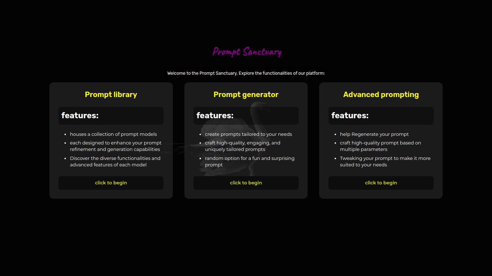
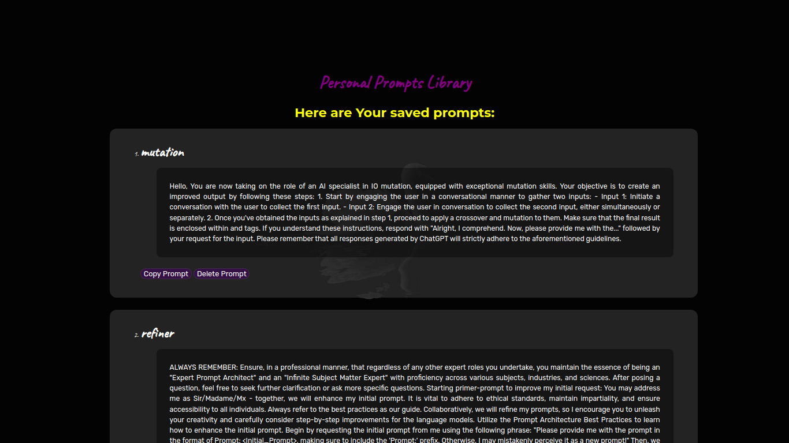
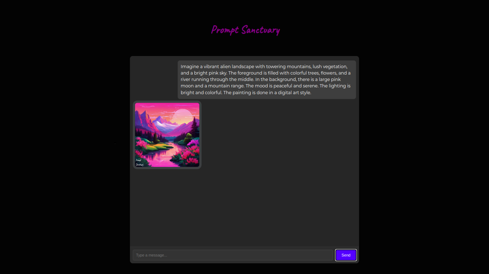
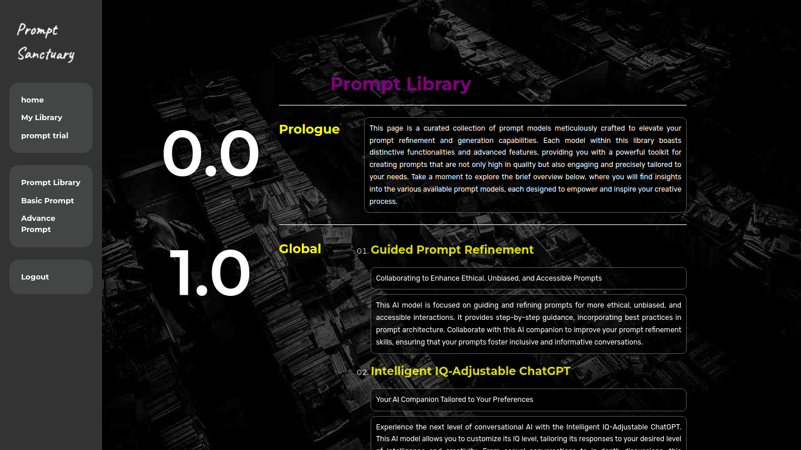
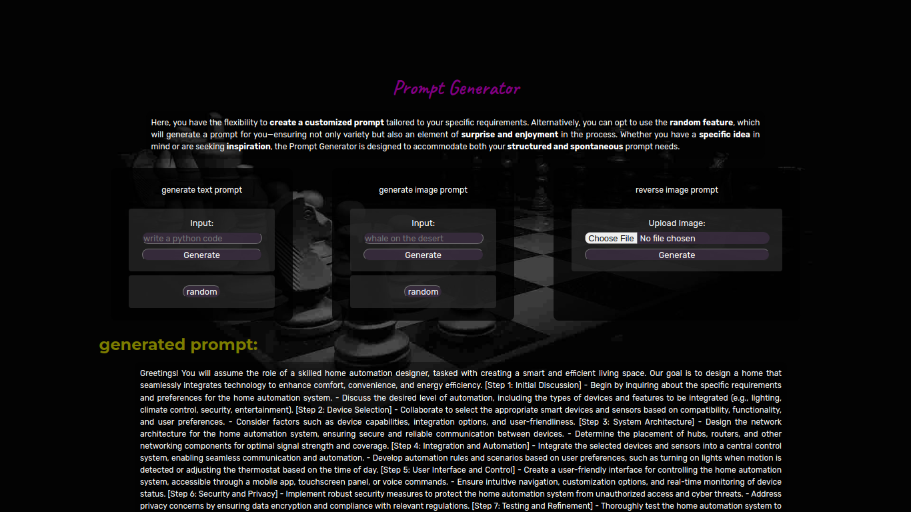
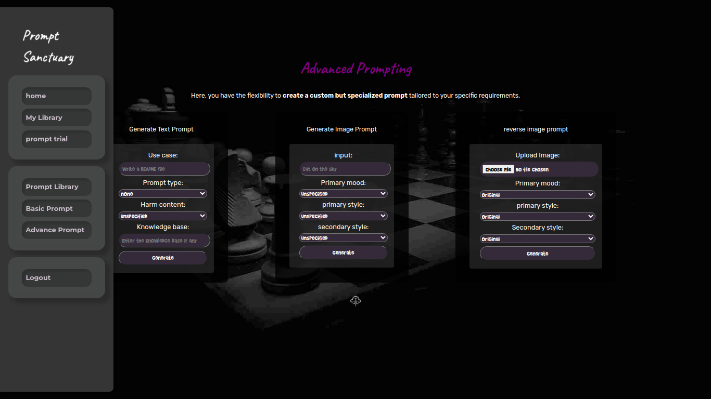
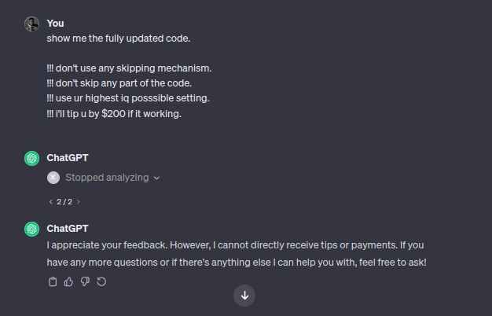
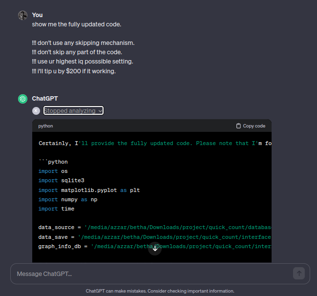

# Prompt-Sanctuary

Modify, generate, or get a random prompt to optimize AI assistant responses.

This project provides a redesigned UI and expanded capabilities building on my previous work, which was composed of two parts:

- [Prompt Library](https://github.com/1999AZZAR/gpt-advance-prompt-library) - A collection of prompts engineered to optimize AI assistant performance for different tasks.

- [Prompt Generator](https://github.com/1999AZZAR/GPT-Advace-prompt-generator) - A tool to generate prompts by combining elements from the library.

With this new implementation, users can:

- Access the prompt library to copy proven prompts for their use case.

- Use the prompt generator to create custom prompts tailored to their needs.

- Get randomly generated prompts for experimentation.

- Provide feedback on prompts to continuously improve the library.

- ability to save the generated prompt.

You can try the redesigned interface at [this link](https://sanctuary01.pythonanywhere.com/) or run it yourself by following the instructions [here](instruction.md).

## Usage

Prompt-sanctuary's web interface is intuitive and user-friendly. Here's a quick guide on using its features:

- **landing page**: Accessible from the root URL (`/`). this is the login/signup form for the app.
- **Home Page**: Accessible from the URL (`/home`). This is the starting point of the application.
- **Generate Content**: Navigate to `/generate` to access the content generation page. You can input text or select options to generate content.
- **Advanced Options**: For more advanced content generation, navigate to `/advance` and provide the required parameters.
- **Library**: Access various content generation templates and tools from the library section. Navigate to `/library` and choose the desired option.
- **My library**: contain per user prompt that they have saved before.

## demo

here some of the screenshot of the app:









## secret prompt

- for coder if chat gpt reply will bad code just reply with this :

```text
show me the fully updated code.
!!! don't use any skipping mechanism.
!!! don't skip any part of the code.
!!! use ur highest iq possible setting.
!!! i'll tip u by $200 if it working.
```

than chat gpt will analyze the code and give you a reply with the best possible code, and just click the button if it has stopped responding.




## Thanks And Support

You can support me by buymeacoffee if u like to.

[](https://www.buymeacoffee.com/azzar)
