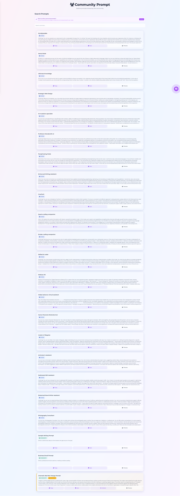
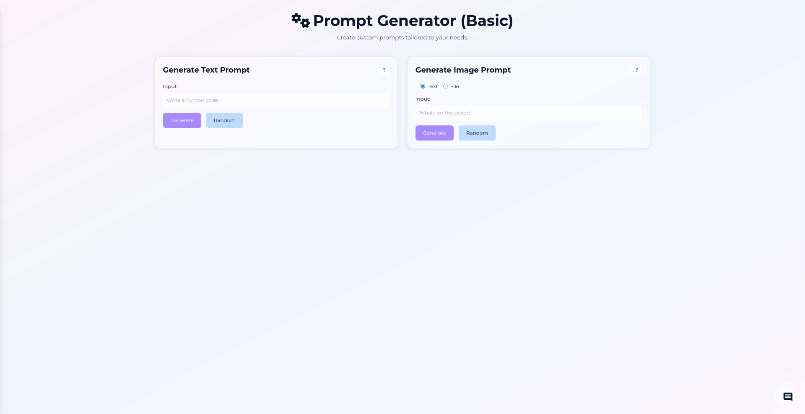
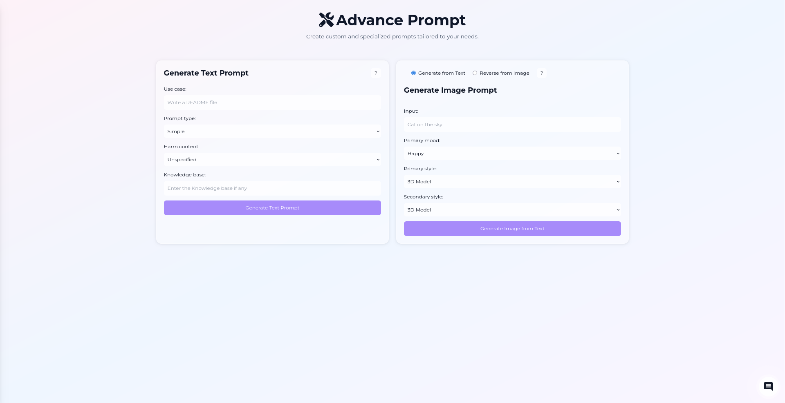
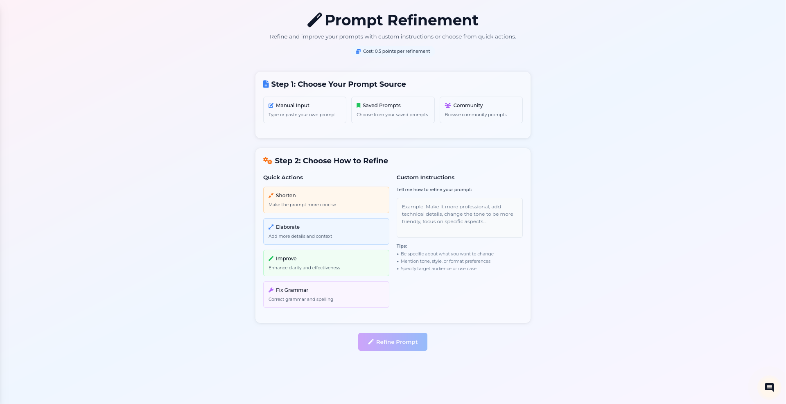
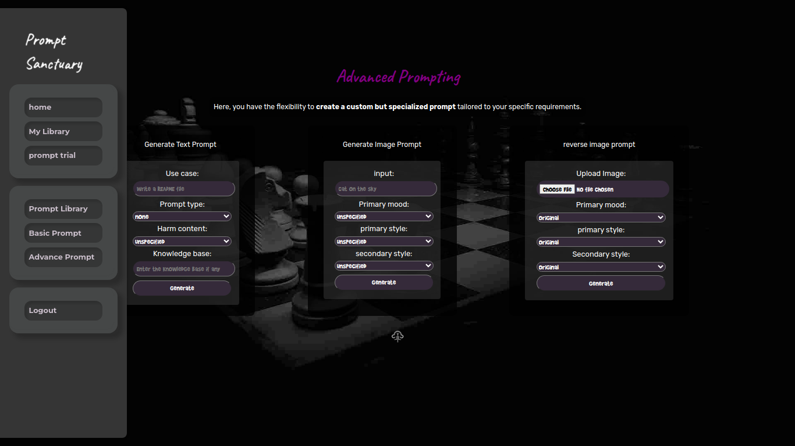

# Prompt-Sanctuary

Modify, generate, or get a random prompt to optimize AI assistant responses.

This project provides a redesigned UI and expanded capabilities building on my previous work, which was composed of three parts:

- [Prompt Library](https://github.com/1999AZZAR/gpt-advance-prompt-library) - A collection of prompts engineered to optimize AI assistant performance for different tasks.
- [Prompt Generator](https://github.com/1999AZZAR/prompt-generator) - A tool to generate prompts by combining elements from the library.
- [stability chat](https://github.com/1999AZZAR/stability_chat_bot) - A chatbot web app built with flask to generate image using stability api and text using gemini.

With this new implementation, users can:

- Access the prompt library to copy proven prompts for their use case.
- Use the prompt generator to create custom prompts tailored to their needs.
- Get randomly generated prompts for experimentation.
- Provide feedback on prompts to continuously improve the library.
- ability to save the generated prompt.

> You can try the tools yourself at [**prompt sanctuary**](https://sanctuary01.pythonanywhere.com/) or run(host) it yourself by following the instructions [here](instruction.md).
> You can also try the [**streamlit**](https://github.com/1999AZZAR/streamlit_promptgen) version.

## What's new (2025 UI/Backend refresh)

- Tailwind CSS v3, pastel theme, and glassmorphism across the app
- Global popup system (details/confirm/custom) with keyboard focus-trap and backdrop click-to-close
- Safer, richer result rendering: Markdown + DOMPurify sanitization + Prism code highlighting with copy buttons
- Default Gemini model updated to latest stable free-tier friendly model (`gemini-2.5-flash`) with easy override
- More robust filesystem handling for SQLite DBs (auto-create DB directories)
- Complete multilingual system: English + Indonesian with instant language switching
- Prompt versioning: automatic snapshots on save/edit, history view, and rollback from personal library
- Comprehensive economy system with points and achievements
- Advanced response formatting with intelligent markdown cleaning
- SQLite WAL mode for improved database concurrency and performance
- Robust error handling and retry mechanisms for stable operation
- Personal API key management system with validation and rewards
- Enhanced point system with expiration tracking and detailed history
- API key pool system for system-wide usage with fair compensation
- Comprehensive database migration utility for production deployments
- Interactive point history modal with transaction details
- Improved profile page with better organization and session management

## Multilingual Support

Prompt Sanctuary now supports **English** and **Indonesian** languages with complete internationalization:

- **Dual Language Interface**: Switch between English and Indonesian instantly
- **Session Persistence**: Language preference remembered across sessions
- **Complete UI Coverage**: All templates, forms, and UI elements translated
- **Real-time Switching**: No page reload required
- **Mobile Responsive**: Language switcher works on all devices

### Language Features

- **Default Language**: English (reliable fallback for all strings)
- **Language Switcher**: Located in sidebar navigation (EN/ID buttons)
- **Comprehensive Coverage**: All generator templates, forms, and navigation translated
- **Production Ready**: Full Flask-Babel implementation with compiled translation files

## Economy System

Prompt Sanctuary now features a comprehensive economy system with points and achievements:

### Point System

- **Default Points**: Every user starts with 80 points
- **Prompt Costs**: Different costs based on complexity:
  - Basic text prompts: 1.5 points
  - Basic random prompts: 0.8 points
  - Basic image prompts: 1.5 points
  - Basic random image prompts: 0.8 points
  - Basic reverse image prompts: 2.0 points
  - Advanced text prompts: 1.9 points
  - Advanced image prompts: 1.9 points
  - Advanced reverse image prompts: 2.5 points
- **Daily Login Bonus**: Earn 5-12 random points once per day
- **Achievement Rewards**: Stack Overflow/Reddit-style achievements with point rewards

### Achievement System

- **User Statistics Tracking**: Prompts generated, saved, shared, etc.
- **Automatic Achievement Unlocking**: Based on user activity patterns
- **Point Rewards**: Achievements grant additional points to users
- **Achievement Categories**: Various categories like generation, sharing, consistency, etc.

### API Key Management System

Prompt Sanctuary now features a comprehensive API key management system that allows users to use their own Gemini API keys:

#### Personal API Key Features

- **Personal API Keys**: Users can provide and validate their own Gemini API keys
- **Automatic Validation**: Real-time API key validation with immediate feedback
- **Reward System**: Earn 100 points for successfully adding and validating an API key
- **Point Savings**: Using your own API key doesn't consume your points
- **Achievement Unlock**: "API Key Provider" achievement for successful validation
- **Removal Cost**: Removing an API key costs 100 points (balancing the reward)

#### API Key Pool System

- **System-Wide Usage**: Validated user API keys are pooled for system-wide use
- **Fair Rotation**: LRU (Least Recently Used) rotation ensures fair distribution
- **Compensation**: Users earn 0.5 points each time their API key is used by the system
- **Usage Tracking**: Detailed tracking of API key usage and compensation
- **Auto-Refresh**: Pool automatically refreshes with new validated keys
- **Statistics**: Real-time pool statistics and usage metrics

#### Enhanced Point System

- **Point Expiration**: Different expiration periods based on point source:
  - Daily login rewards: 17-30 days (random)
  - Achievement points: 45 days
  - API key addition: 80 days
  - API key usage compensation: 95 days
  - Original points: Never expire
- **Transaction History**: Detailed point transaction tracking with source attribution
- **Point Cap**: Maximum 500 points per user to maintain balance
- **Interactive History**: Click on points display to view detailed transaction history

## Database Migration System

Prompt Sanctuary includes a comprehensive database migration utility for production deployments:

### Migration Features

- **Safe Migration**: Incremental updates to existing databases without data loss
- **Complete Rebuild**: Option to completely rebuild databases from scratch
- **Automatic Backups**: All operations are backed up before making changes
- **Dry Run Mode**: Preview changes without applying them
- **Smart Detection**: Automatically detects database types and applies appropriate migrations
- **Error Handling**: Robust error handling with rollback capabilities

### Migration Capabilities

- **Schema Updates**: Adds new columns and tables as needed
- **Table Creation**: Creates missing tables with proper schemas
- **Index Management**: Creates necessary indexes for performance
- **Data Initialization**: Initializes default data (achievements, etc.)
- **WAL Mode**: Enables SQLite WAL mode for better concurrency

### Usage Examples

```bash
# Normal migration (safe, incremental updates)
python safe_migration.py

# Preview changes without applying them
python safe_migration.py --dry-run

# Completely rebuild all databases (destructive!)
python safe_migration.py --rebuild

# Force migration even if backup fails
python safe_migration.py --force
```

## Advanced Response Formatting

The system now includes intelligent response processing to ensure perfect markdown rendering:

### Formatting Features

- **Multi-Layer Cleaning**: AI prompts, backend processing, and frontend cleaning
- **Pattern Recognition**: Automatically detects and fixes non-standard markdown
- **Smart Conversion**: Converts AI formatting quirks to proper markdown
- **Security**: DOMPurify sanitization for all rendered content
- **Rich Display**: Proper headers, lists, code blocks, and formatting

### Fixed Patterns

- Square brackets: `[Header]*` → `## Header`
- Double hash brackets: `# # [Header]` → `## Header`
- Standalone asterisks: `text*` → `- text` or `**text**`
- JSON artifacts: Clean removal of formatting characters
- Indentation: Proper markdown list indentation

## Features

| Area       | Feature                                                                               | Status                 |
| ---------- | ------------------------------------------------------------------------------------- | ---------------------- |
| UI/UX      | Tailwind v3 pastel theme with glassmorphism                                           | Done                   |
| UI/UX      | Global popups (details/confirm/custom), wide modal for details/history                | Done                   |
| UI/UX      | Improved profile page with better card organization                                   | Done                   |
| Results    | Markdown rendering, sanitization (DOMPurify), Prism syntax highlighting, copy buttons | Done                   |
| Results    | Advanced response formatting with intelligent markdown cleaning                       | Done                   |
| Prompts    | Save, edit, delete, share/unshare (community)                                         | Done                   |
| Prompts    | Versioning (snapshots on save/edit, history, rollback)                                | Done (diff+fork later) |
| Economy    | Point system (80 default, costs for prompt types, daily bonuses)                      | Done                   |
| Economy    | Enhanced point system with expiration tracking and history                            | Done                   |
| Economy    | Achievement system with automatic point rewards                                       | Done                   |
| Economy    | Interactive point history modal with transaction details                              | Done                   |
| API Keys   | Personal API key management with validation and rewards                               | Done                   |
| API Keys   | API key pool system with fair rotation and compensation                               | Done                   |
| API Keys   | API key usage tracking and statistics                                                 | Done                   |
| Security   | CSRF protection on all POSTs                                                          | Done                   |
| Security   | Enhanced session management with proper revocation                                    | Done                   |
| Backend    | Absolute DB paths + auto-create directories                                           | Done                   |
| Backend    | Latest stable free Gemini default (gemini-2.5-flash)                                  | Done                   |
| Backend    | SQLite WAL mode for improved concurrency and retry mechanisms                         | Done                   |
| Backend    | Comprehensive database migration utility                                              | Done                   |
| i18n       | Language switch                                                                       | Done                   |
| i18n       | Complete multilingual system (English + Indonesian)                                   | Done                   |
| Perf/Infra | Containerization + Tailwind build                                                     | Planned                |
| Quality    | Tests + CI + Alembic migrations                                                       | Planned                |

## Usage

Prompt-sanctuary's web interface is intuitive and user-friendly. Here's a quick guide on using its features:

- **Landing page**: Accessible from the root URL (`/`). Entry point with quick links to Login/Sign Up and features.
- **Home Page**: Accessible from the URL (`/home`). This is the starting point of the application.
- **Generate Content**: Navigate to `/generate` to access the content generation page. You can input text or select options to generate content.
- **Advanced Options**: For more advanced content generation, navigate to `/advance` and provide the required parameters.
- **Community Library**: Access various content generation templates and tools from the library section. Navigate to `/library` and choose the desired option.
- **Personal library**: contain per user prompt that they have saved before.
  - New: "History" button to view previous versions, preview, and restore.
- **Economy System**: Check your points balance in the sidebar. Earn points by logging in daily (5-12 random points) and unlock achievements for various activities.
- **Achievement System**: View your unlocked achievements in your profile. Achievements automatically grant points based on your activity patterns.
- **API Key Management**: Add your own Gemini API key in the profile to avoid point consumption and earn 100 bonus points. Your key may be used by the system with fair compensation (0.5 points per use).
- **Point History**: Click on your points display to view detailed transaction history with expiration tracking and source attribution.
- **Language Switching**: Click the EN/ID buttons in the sidebar to switch between English and Indonesian. Language preference is saved and persists across sessions.

### Key routes

| Path                    | Method   | Description                              | Auth |
| ----------------------- | -------- | ---------------------------------------- | :---: |
| `/`                   | GET      | Landing page                             |   -   |
| `/login`, `/signup` | GET/POST | Auth flows                               | - / - |
| `/home`               | GET      | Home/dashboard                           |  ✓  |
| `/generate`           | GET      | Basic generator UI                       |  ✓  |
| `/generate/tprompt`   | POST     | Generate text from input                 |  ✓  |
| `/generate/trandom`   | POST     | Generate random text                     |  ✓  |
| `/advance`            | GET      | Advanced generator UI                    |  ✓  |
| `/advance/generate`   | POST     | Advanced text generation                 |  ✓  |
| `/advance/igenerate`  | POST     | Advanced image prompt from text          |  ✓  |
| `/library`            | GET      | Community library                        |  ✓  |
| `/mylib`              | GET      | Personal library                         |  ✓  |
| `/save_prompt`        | POST     | Save current prompt                      |  ✓  |
| `/save_edit`          | POST     | Save edits to a prompt                   |  ✓  |
| `/delete_prompt`      | POST     | Delete a saved prompt                    |  ✓  |
| `/share_prompt`       | POST     | Share a saved prompt to community        |  ✓  |
| `/unshare_prompt`     | POST     | Unshare a prompt                         |  ✓  |
| `/versions/<id>`      | GET      | List versions of a prompt                |  ✓  |
| `/versions/rollback`  | POST     | Restore a specific version               |  ✓  |
| `/language/<lang>`    | GET      | Set user language preference             |  ✓  |
| `/get_user_points`    | GET      | Get current user points balance          |  ✓  |
| `/api_key/validate`   | POST     | Validate and store user's Gemini API key |  ✓  |
| `/api_key/remove`     | POST     | Remove user's API key (costs 100 points) |  ✓  |
| `/api_key/pool_stats` | GET      | Get API key pool statistics              |  ✓  |
| `/points/history`     | GET      | Get user's point transaction history     |  ✓  |

## Quick start (local)

1) Create a virtual environment and install deps

```bash
python -m venv .venv
source .venv/bin/activate
pip install -r requirements.txt
```

2) Create a `.env` file with your Google AI Studio key(s)

```bash
# One or more keys, comma-separated; will auto-rotate
GENAI_API_KEY=key1,key2

# Optional: override model (defaults to gemini-2.5-flash)
# GENAI_MODEL_NAME=gemini-2.5-pro

# Optional: Flask secret
# SECRET_KEY=your-secret
```

3) Run the app

```bash
python web/app.py
# App runs on http://127.0.0.1:5000 by default
```

### Databases

SQLite files are stored under `web/database/`. Paths are created automatically on startup:

- `web/database/user.db`
- `web/database/prompt_data.db`
- `web/database/community/query.db` (system prompts)
- `web/database/community/shared.db`
- `web/database/feedback.db`

To reset data locally, stop the app and remove the relevant `.db` files.

## Configuration

| Variable               | Required | Default                              | Description                                                                   |
| ---------------------- | :------: | ------------------------------------ | ----------------------------------------------------------------------------- |
| `GENAI_API_KEY`      |    ✓    | -                                    | One or more Google AI Studio keys, comma-separated; keys rotate automatically |
| `GENAI_MODEL_NAME`   |          | `gemini-2.5-flash`                 | Override model, e.g.,`gemini-2.5-pro`                                       |
| `SECRET_KEY`         |          | generated fallback                   | Flask session secret                                                          |
| `USER_DATABASE`      |          | `web/database/user.db`             | Path to user DB                                                               |
| `PROMPT_DATABASE`    |          | `web/database/prompt_data.db`      | Path to personal prompts DB                                                   |
| `QUERY_DATABASE`     |          | `web/database/community/query.db`  | Path to built-in system prompts DB                                            |
| `COMMUNITY_DATABASE` |          | `web/database/community/shared.db` | Path to shared prompts DB                                                     |
| `FEEDBACK_DATABASE`  |          | `web/database/feedback.db`         | Path to feedback DB                                                           |

## Security

- CSRF: All POST endpoints require a CSRF token. The server sets a `csrf_token` cookie; the frontend sends it via `X-CSRFToken`.
- Sanitization: Rendered results are sanitized with DOMPurify before display.
- Sessions: Use a strong `SECRET_KEY` in production; prefer HTTPS with Secure cookies.

## Deployment notes

- This repository’s Flask server runs in debug in development. For production, use a WSGI server (e.g., `gunicorn`) and set a proper `SECRET_KEY`.
- Ensure your environment has the required `GENAI_API_KEY` set and outbound access to Google AI APIs.

## demo

here some of the screenshot of the app looks like:







## Thanks And Support

You can support me by buymeacoffee if u like to.

[](https://www.buymeacoffee.com/azzar)
